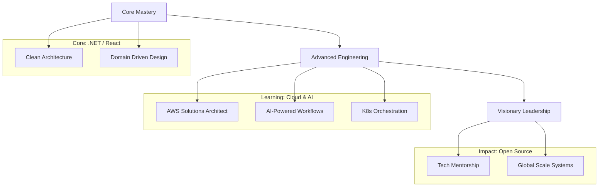

<div align="center">

<!-- Header Section -->


<!-- Typing Animation -->


<!-- Profile Badges -->
<p>
  
  
  
  
</p>

<h3>🌌 Welcome to My Interactive Universe 🌌</h3>

---

</div>

## 👨‍🔬 The Architect's Profile

<div align="center">
<table>
<tr>
<td width="55%" valign="top">

```typescript
/**
 * @profile Biniyam Tehakele
 * @role Full-Stack Developer & Innovator
 */
const identity = {
  origin: "Addis Ababa, Ethiopia 🇪🇹",
  expertise: ["Distributed Systems", "Modern UI/UX", "Microservices"],
  toolkit: ["React", ".NET Core", "TypeScript", "PostgreSQL"],
  mission: "Building high-performance, scalable digital solutions.",
  philosophy: [
    "Clean Code", 
    "User-Centric Design", 
    "Continuous Evolution"
  ],
  currently_leveling: {
    skill: "System Design",
    focus: "Cloud-Native Architecture"
  }
};

console.log(`Let's engineer the future! 🚀`);
```

**Self-taught & Passion-driven.** With over **25+ production-grade projects**, I specialize in bridging the gap between complex backend logic and seamless frontend experiences. I'm dedicated to writing code that isn't just functional, but a work of art.

</td>
<td width="45%" align="center">

</td>
</tr>
</table>
</div>

---

## 🛠️ The Tech Arsenal

<div align="center">

### 🎨 Frontend Engineering
<p>

</p>

### ⚙️ Backend & Systems
<p>

</p>

### 💾 Data & Cloud
<p>

</p>

### 🔧 Tools & Workflow
<p>

</p>

</div>

---

## 📊 Analytics & Insights

<div align="center">


<br/>


<br/>


<br/>


</div>

---

## 🚀 Featured Engineering Works

<div align="center">

<table>
<tr>
<td width="50%" valign="top">

### 🛒 EcoMart: Next-Gen E-commerce


**High-performance shop with .NET Core & React.**

**✨ Key Innovation:**
- ⚡ **Redis Cache Layer** for sub-100ms response.
- 💳 **Stripe 3D Secure** integration.
- 📊 **Real-time Inventory** tracking via SignalR.

<div align="center">

[](https://ecomart-demo.netlify.app)
[](https://github.com/binadev29/ecomart)

</div>

</td>
<td width="50%" valign="top">

### 🤖 TaskFlow: Enterprise PM Tool


**Collaborative workspace with real-time sync.**

**✨ Key Innovation:**
- 👥 **Socket.io** for multi-user collaboration.
- 📊 **Dynamic Analytics** with Chart.js.
- 🎨 **Glassmorphism UI** using Tailwind.

<div align="center">

[](https://taskflow-demo.vercel.app)
[](https://github.com/binadev29/taskflow)

</div>

</td>
</tr>
</table>

</div>

---

## 🎯 Strategic Roadmap

<div align="center">



</div>

---

## 🤝 Let's Collaborate

<div align="center">

<h3>🚀 Moving at the Speed of Thought? Let's connect.</h3>

<p>
<a href="mailto:biniyamtehakele9@gmail.com">

</a>
<a href="https://linkedin.com/in/binitehakele">

</a>
<a href="https://biniyamtehakeleportfolio.netlify.app">

</a>
</p>

<a href="https://calendly.com/biniyamtehakele">

</a>

<br/><br/>

| 🌍 Location | ⏰ Timezone | ⚡ Response |
| :--- | :--- | :--- |
| Addis Ababa, Ethiopia 🇪🇹 | EAT (UTC+3) | Within 12h |

</div>

---

<div align="center">

### 🎵 In The Flow
[](https://open.spotify.com/user/binadev29)

### 💬 Wisdom of the Day


*"Engineering the digital renaissance from Ethiopia to the globe. 🌍"*


</div>
