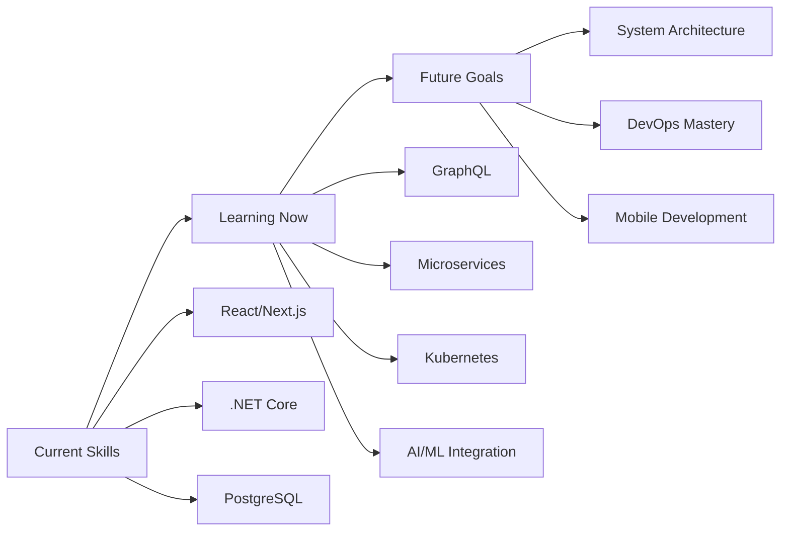

<div align="center">


<p>
  
  
  
  
  
</p>

<h3>🌟 Welcome to my digital universe! 🌟</h3>

</div>

---

## 👨‍💻 About Me


```typescript
interface Developer {
  name: string;
  location: string;
  role: string;
  experience: string;
  techStack: TechStack;
  currentFocus: string;
  availableFor: string;
  passion: string[];
}

const biniyam: Developer = {
  name: "Biniyam Tehakele",
  location: "Addis Ababa, Ethiopia 🇪🇹",
  role: "Full-Stack Developer",
  experience: "3+ Years (Since 2022)",
  
  techStack: {
    frontend: ["React", "Next.js", "TypeScript", "Tailwind CSS"],
    backend: [".NET Core", "Node.js", "Express"],
    databases: ["PostgreSQL", "MongoDB", "Redis"],
    tools: ["Git", "Docker", "AWS", "Vercel"],
    currentlyLearning: ["GraphQL", "Microservices", "Kubernetes"]
  },
  
  currentFocus: "Building scalable web applications with modern technologies",
  availableFor: "Full-time opportunities and exciting projects",
  passion: ["Clean Code", "Problem Solving", "Innovation", "Mentoring"]
};

console.log("Ready to build amazing things together! 🚀");
```

**🚀 Self-taught developer** passionate about creating efficient, user-friendly applications. Experienced in building **25+ projects** ranging from e-commerce platforms to management systems. Strong advocate for **clean code**, **best practices**, and **continuous learning**.

---

## 🛠️ Tech Arsenal

<div align="center">

### 🎨 Frontend Technologies
<p>

</p>

### ⚙️ Backend & Database
<p>

</p>

### 🔧 Tools & Platforms
<p>

</p>

</div>

---

## 📈 GitHub Analytics

<div align="center">


</div>

<div align="center">


</div>

<div align="center">


</div>

<div align="center">


</div>

---

## 🚀 Featured Projects

<div align="center">

<table>
<tr>
<td width="50%" valign="top">

### 🛒 EcoMart E-commerce Platform


**Full-stack e-commerce solution with modern UI/UX**

**🛠️ Tech Stack:** React, .NET Core, PostgreSQL, Redis  

**✨ Features:**
- 🔍 Real-time product search & filtering
- 💳 Secure payment integration (Stripe)
- 📱 Fully responsive design
- 🔐 JWT authentication & authorization
- 📊 Comprehensive admin dashboard
- 🛒 Shopping cart with session management
- 📧 Email notifications

<div align="center">

[](https://ecomart-demo.netlify.app)
[](https://github.com/binadev29/ecomart)

</div>

</td>
<td width="50%" valign="top">

### 🤖 TaskFlow Management System


**Project management tool with team collaboration**

**🛠️ Tech Stack:** Next.js, TypeScript, MongoDB, Socket.io

**✨ Features:**
- 📋 Kanban-style task organization
- 👥 Real-time team collaboration
- 📈 Advanced progress analytics
- ⚡ Live updates & notifications
- 🎨 Intuitive drag-and-drop interface
- 📊 Time tracking & reporting
- 🔒 Role-based permissions

<div align="center">

[](https://taskflow-demo.vercel.app)
[](https://github.com/binadev29/taskflow)

</div>

</td>
</tr>
<tr>
<td width="50%" valign="top">

### 🎨 Professional Portfolio


**Personal branding platform with stunning animations**

**🛠️ Tech Stack:** React, Tailwind CSS, Framer Motion, Three.js

**✨ Features:**
- 🎭 Smooth page transitions & animations
- 📱 Mobile-first responsive design
- 🔍 SEO optimized with meta tags
- ⚡ Lightning-fast performance
- 📧 Contact form with email integration
- 🌙 Dark/Light mode toggle
- 🎯 Interactive 3D elements

<div align="center">

[](https://biniyamtehakeleportfolio.netlify.app)
[](https://github.com/binadev29/portfolio)

</div>

</td>
<td width="50%" valign="top">

### 🔐 SecureAuth API


**Enterprise-grade authentication microservice**

**🛠️ Tech Stack:** .NET Core, JWT, OAuth2, Redis, Docker

**✨ Features:**
- 🔒 Multi-factor authentication (MFA)
- 🌐 Social login integration (Google, GitHub)
- 👤 Role-based access control (RBAC)
- 🔄 Refresh token rotation
- 🛡️ Rate limiting & security headers
- 📱 Mobile app support
- 🔍 Audit logging & monitoring

<div align="center">

[](https://secureauth-api.herokuapp.com/swagger)
[](https://github.com/binadev29/secure-auth)

</div>

</td>
</tr>
</table>

</div>

---

## 🎯 What I Bring to Your Team

<div align="center">

<table>
<tr>
<td align="center" width="25%">

<h4>💻 Technical Excellence</h4>
<p>Clean, maintainable code following SOLID principles and industry best practices</p>
</td>
<td align="center" width="25%">

<h4>🚀 Problem Solving</h4>
<p>Analytical approach to complex challenges with creative and efficient solutions</p>
</td>
<td align="center" width="25%">

<h4>🌱 Growth Mindset</h4>
<p>Continuous learning, adaptation, and staying current with emerging technologies</p>
</td>
<td align="center" width="25%">

<h4>🤝 Collaboration</h4>
<p>Strong communication skills and experience in cross-functional team environments</p>
</td>
</tr>
</table>

</div>

### 🏆 Key Achievements & Highlights

<div align="center">

| 🚀 **Projects** | 📈 **Experience** | 🎯 **Learning** | 🌍 **Impact** | ☕ **Innovation** |
|:---:|:---:|:---:|:---:|:---:|
| 25+ Built | 3+ Years | Self-Taught | International Standards | Ethiopian Tech Scene |
| E-commerce to SaaS | Since 2022 | Continuous Growth | Global Best Practices | Local Innovation |
| Full-Stack Focus | Production Ready | Technology Agnostic | Quality Driven | Community Minded |

</div>

---

## 📚 Current Learning Journey

<div align="center">



</div>

### 🎯 2024 Learning Roadmap

- 🏗️ **System Design & Architecture** - Scalable application design patterns
- ☁️ **Cloud Native Development** - Advanced AWS services and deployment strategies  
- 🤖 **AI/ML Integration** - Incorporating AI capabilities into web applications
- 📱 **Mobile Development** - React Native for cross-platform mobile apps
- 🔧 **DevOps & CI/CD** - Advanced deployment pipelines and infrastructure as code

---

## 🎯 Current Status & Availability

<div align="center">


</div>

```javascript
const currentStatus = {
  🎯 lookingFor: "Full-time Full-Stack Developer position",
  🔥 interests: [
    "React/Next.js Ecosystem", 
    ".NET Core Development", 
    "Cloud Architecture", 
    "AI/ML Integration",
    "Open Source Contribution"
  ],
  ⚡ availability: "Immediately available",
  🌍 workPreference: ["Remote", "Hybrid", "On-site (Addis Ababa)"],
  💰 salaryRange: "Competitive & Negotiable",
  
  📚 currentlyLearning: [
    "Advanced System Design",
    "Kubernetes & Container Orchestration", 
    "GraphQL & Apollo",
    "React Native Development"
  ],
  
  🎯 careerGoals: [
    "Lead technical teams",
    "Architect scalable systems",
    "Mentor junior developers",
    "Contribute to open source"
  ]
};
```

---

## 🤝 Let's Connect & Collaborate

<div align="center">

<h3>🌟 Ready to build something amazing together? 🌟</h3>

<p>
<a href="mailto:biniyamtehakele9@gmail.com">

</a>
<a href="https://linkedin.com/in/binitehakele">

</a>
<a href="https://biniyamtehakeleportfolio.netlify.app">

</a>
<a href="https://github.com/binadev29">

</a>
</p>

<a href="https://calendly.com/biniyamtehakele">

</a>

</div>

### 📍 Contact Information

<div align="center">

| 🌍 **Location** | ⏰ **Timezone** | 📧 **Email** | ⚡ **Response Time** |
|:---:|:---:|:---:|:---:|
| Addis Ababa, Ethiopia 🇪🇹 | EAT (UTC+3) | biniyamtehakele9@gmail.com | < 12 hours |

</div>

### 🎯 What I'm Looking For

- 🚀 **Challenging Projects** - Complex problems that push my skills
- 🌱 **Growth Opportunities** - Companies that invest in employee development  
- 🤝 **Collaborative Culture** - Teams that value knowledge sharing
- 🌍 **Global Impact** - Products that make a difference worldwide
- 💡 **Innovation Focus** - Organizations embracing cutting-edge technologies

---

## 💝 Support My Work

<div align="center">

If you find my projects helpful or interesting, consider:

<p>
<a href="https://github.com/binadev29">

</a>
<a href="https://buymeacoffee.com/binadev29">

</a>
</p>

</div>

---

<div align="center">

### 🎵 Currently Vibing To
[](https://open.spotify.com/user/binadev29)

---

### 💭 Random Dev Quote


---


*"Building the future through code, one commit at a time. From Ethiopia to the world 🌍"*


</div>
