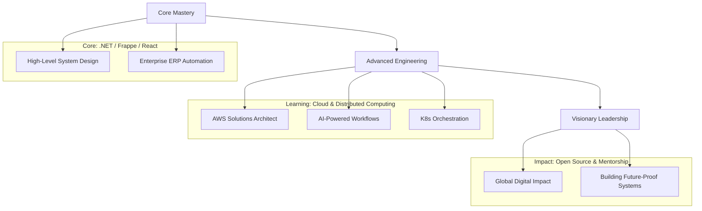

<div align="center">

<!-- Header Section: Advanced Waving Banner -->


<!-- Typing Animation: Precise Roles -->


<!-- Profile Badges -->
<p align="center">
  
  
  
  
</p>

<h3>🌌 Welcome to My Interactive Universe 🌌</h3>

---

</div>

## 👨‍💻 The Architect's Profile

<div align="center">
<table>
<tr>
<td width="55%" valign="top">

```typescript
/**
 * @profile Biniyam Tehakele
 * @role Computer Science Student & Full-Stack Developer
 */
const identity = {
  origin: "Addis Ababa, Ethiopia 🇪🇹",
  expertise: [
    "Enterprise Resource Planning (ERP)", 
    "System Architecture", 
    "Full-Stack Engineering"
  ],
  toolkit: [".NET Core", "Python", "React", "TypeScript"],
  mission: "Bridging theoretical Computer Science with practical software excellence.",
  current_project: "Global ERP Solutions & Automation 🚀"
};

console.log("Solving global problems through algorithmic elegance.");
```

**Ambitious Computer Science student.** Dedicated to mastering software architecture and building high-performance systems. I specialize in backend logic (ERPNext/Frappe) and modern frontend UI/UX (React). Driven by a mission to turn complex problems into world-class software solutions.

</td>
<td width="45%" align="center">

</td>
</tr>
</table>
</div>

---

## 🛠️ The Tech Stack (Core Engineering Toolkit)

<div align="center">

### 🎨 Frontend Engineering
<p align="center">

</p>

### ⚙️ Backend & Systems
<p align="center">

</p>

### 💾 Data & Infrastructure
<p align="center">

</p>

### 🔧 Tools & Workflow
<p align="center">

</p>

</div>

---

## 🚀 Featured Engineering Works (Enterprise Automation)

<div align="center">

<table>
<tr>
<td width="50%" valign="top">

### 🏢 ECX Property Automation (PAS)


**ERPNext Implementation for Ethiopian Commodity Exchange.**

**✨ Key Innovations:**
- 🛡️ **Safety Box Logic** with dynamic weight/volume validation.
- 📦 **User Custodian tracking** for enterprise-scale assets.
- 📄 **Custom GRN/SIV** automated document management.

<div align="center">

[](https://github.com/binadev29/ERPNext_Server_Script/tree/main/Stock)

</div>

</td>
<td width="50%" valign="top">

### ⚖️ ERPNext HR (Ethiopian Standard)


**Advanced HR management customized for Ethiopian Labor Law.**

**✨ Key Innovations:**
- 📅 **Dynamic Leave Allocation** (Annual, Sick, Maternity).
- 💰 **Severance Pay Automation** according to proclamation.
- 🔔 **Probation Expiry Alerts** and automated workflows.

<div align="center">

[](https://github.com/binadev29/ERPNext_Server_Script/tree/main/HR)

</div>

</td>
</tr>
</table>

</div>

---

## 📊 Analytics & Impact Insights

<div align="center">

<!-- GitHub Stats Card -->
<a href="https://github.com/binadev29">
  
</a>

<!-- Top Languages Card -->
<a href="https://github.com/binadev29">
  
</a>

<br/>

<a href="https://github.com/binadev29">
  
</a>

</div>

<br/>

<div align="center">

<!-- Activity Graph -->
<a href="https://github.com/binadev29">
  
</a>

</div>

---

## 🎯 Strategic Roadmap

<div align="center">


```mermaid
graph TD
    A[Core Mastery] --> B[Advanced Engineering]
    B --> C[Visionary Leadership]
    
    subgraph "Core: .NET / Frappe / React"
    A1[High-Level System Design]
    A2[Enterprise ERP Automation]
    end
    
    subgraph "Learning: Cloud & Distributed Computing"
    B1[AWS Solutions Architect]
    B2[AI-Powered Workflows]
    B3[K8s Orchestration]
    end
    
    subgraph "Impact: Open Source & Mentorship"
    C1[Global Digital Impact]
    C2[Building Future-Proof Systems]
    end
    
    A --> A1 & A2
    B --> B1 & B2 & B3
    C --> C1 & C2
```

</div>

---

## 🤝 Let's Collaborate

<div align="center">

<h3>🚀 Moving at the Speed of Thought? Let's connect.</h3>

<p align="center">
<a href="mailto:biniyamtehakele9@gmail.com">

</a>
<a href="https://linkedin.com/in/binitehakele">

</a>
<a href="https://biniyamtehakeleportfolio.netlify.app">

</a>
</p>

<a href="https://calendly.com/biniyamtehakele">

</a>

<br/><br/>

| 🌍 Location | ⏰ Timezone | ⚡ Response |
| :--- | :--- | :--- |
| Addis Ababa, Ethiopia 🇪🇹 | EAT (UTC+3) | Within 12h |

</div>

---

<div align="center">

### 💬 Wisdom of the Day


<br/>

*"Solving global problems through software elegance and algorithmic logic. 💻🌍"*


</div>
