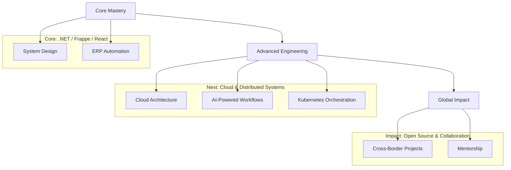

<div align="center">

<!-- ============================================================ -->
<!-- HEADER BANNER                                                 -->
<!-- ============================================================ -->


<!-- ============================================================ -->
<!-- TYPING ANIMATION                                              -->
<!-- ============================================================ -->


<!-- ============================================================ -->
<!-- PROFILE BADGES                                                -->
<!-- ============================================================ -->
<p align="center">
  
  
  
  
</p>

<h3>🌐 Computer Science Student • Building Systems That Scale Across Borders 🌐</h3>

<p>
  <a href="#-about-me">About</a> •
  <a href="#-tech-stack">Tech Stack</a> •
  <a href="#-featured-projects">Projects</a> •
  <a href="#-github-analytics">Analytics</a> •
  <a href="#-roadmap">Roadmap</a> •
  <a href="#-lets-connect">Contact</a>
</p>

---

</div>

## 👨‍💻 About Me

<div align="center">
<table>
<tr>
<td width="55%" valign="top">

```typescript
/**
 * @profile Biniyam Tehakele
 * @role   Computer Science Student (Full-Stack Development track)
 * @base   Addis Ababa, Ethiopia
 */
const profile = {
  base: "Addis Ababa, Ethiopia 🇪🇹",
  worksWith: "Clients & teams worldwide 🌍",
  focus: [
    "Enterprise Resource Planning (ERP)",
    "System Architecture",
    "Full-Stack Engineering",
  ],
  stack: [".NET Core", "Python", "React", "TypeScript"],
  mission:
    "Building reliable, well-architected software for global teams.",
  currentlyBuilding: "ERP automation & workflow tooling 🚀",
};

function introduce(p: typeof profile): string {
  return [
    `Hi, I'm Biniyam — a developer based in ${p.base}.`,
    `I specialize in ${p.focus.join(", ")}.`,
    `Currently building: ${p.currentlyBuilding}`,
  ].join("\n");
}

console.log(introduce(profile));
// -> Open to remote & international collaboration.
```

I'm a Computer Science student focused on backend architecture
(ERPNext/Frappe) and modern frontend engineering (React/TypeScript).
Alongside my studies, I build software for real organizations and
collaborate happily across time zones with teams anywhere in the world.

**What I care about:**
- Clean, maintainable architecture over quick hacks
- Automating repetitive business processes end-to-end
- Writing documentation people actually want to read
- Shipping small, testable increments rather than giant rewrites

</td>
<td width="45%" align="center">

</td>
</tr>
</table>
</div>

---

## 🛠️ Tech Stack

<div align="center">

### Frontend
<p align="center">

</p>

### Backend & Systems
<p align="center">

</p>

### Data & Infrastructure
<p align="center">

</p>

### Tools & Workflow
<p align="center">

</p>

</div>

### Proficiency Snapshot

| Category | Technologies | Comfort Level |
| :--- | :--- | :--- |
| Backend Frameworks | ERPNext / Frappe, .NET Core, Express | ⭐⭐⭐⭐⭐ |
| Languages | Python, TypeScript, JavaScript, C# | ⭐⭐⭐⭐⭐ |
| Frontend | React, Next.js, Tailwind CSS | ⭐⭐⭐⭐ |
| Databases | PostgreSQL, MySQL, MongoDB, Redis | ⭐⭐⭐⭐ |
| DevOps | Docker, Azure, Git/GitHub Actions | ⭐⭐⭐ |
| Other | REST API design, system architecture, automation scripting | ⭐⭐⭐⭐ |

---

## 🚀 Featured Projects

<div align="center">
<table>
<tr>
<td width="50%" valign="top">

### 🏢 ECX Property Automation System (PAS)

**ERPNext implementation for a commodity exchange platform.**

- 🛡️ Custom safety-box logic with dynamic weight/volume validation
- 📦 Enterprise-scale asset & custodian tracking
- 📄 Automated GRN/SIV document workflows
- 🔄 Server-side scripting to enforce business rules at the database layer

**Stack:** Frappe / ERPNext, Python, MariaDB

[](https://github.com/binadev29/ERPNext_Server_Script/tree/main/Stock)

</td>
<td width="50%" valign="top">

### ⚖️ ERPNext HR Automation

**Configurable HR management built for local labor-law compliance,
adaptable to other jurisdictions.**

- 📅 Dynamic leave allocation (annual, sick, maternity)
- 💰 Automated severance/termination pay calculations
- 🔔 Probation-expiry alerts & automated workflows
- 📊 HR reporting dashboards for management review

**Stack:** Frappe / ERPNext, Python, JavaScript

[](https://github.com/binadev29/ERPNext_Server_Script/tree/main/HR)

</td>
</tr>
</table>
</div>

### More on GitHub

Browse the rest of my work, including smaller scripts, experiments, and
contributions, directly on my profile:

[](https://github.com/binadev29?tab=repositories)

---

## 📊 GitHub Analytics

<div align="center">

<a href="https://github.com/binadev29">
  
  
</a>

<br/>

<a href="https://github.com/binadev29">
  
</a>

<br/><br/>

<a href="https://github.com/binadev29">
  
</a>

</div>

> ⚠️ **Note on reliability:** `github-readme-stats.vercel.app` is a shared
> public instance used by thousands of profiles. GitHub enforces an hourly
> API-call limit on that server's account, so cards occasionally show
> "Failed to retrieve contributions" when the shared quota is exhausted —
> this is not an issue with your account or this file. `cache_seconds=86400`
> above tells the service to keep serving your last successful render for
> 24 hours, which prevents most failures from ever reaching your visitors.
> For a permanent fix, deploy your own free instance from the
> [github-readme-stats repository](https://github.com/anuraghazra/github-readme-stats#deploy-on-your-own)
> and swap the domain in the image URLs above for your own Vercel URL.

---

## 🎯 Roadmap


```mermaid
graph TD
    A[Core Mastery] --> B[Advanced Engineering]
    B --> C[Global Impact]

    subgraph "Core: .NET / Frappe / React"
    A1[System Design]
    A2[ERP Automation]
    end

    subgraph "Next: Cloud & Distributed Systems"
    B1[Cloud Architecture]
    B2[AI-Powered Workflows]
    B3[Kubernetes Orchestration]
    end

    subgraph "Impact: Open Source & Collaboration"
    C1[Cross-Border Projects]
    C2[Mentorship]
    end

    A --> A1 & A2
    B --> B1 & B2 & B3
    C --> C1 & C2
```

### Milestones

- [x] Ship production ERP automation for a national exchange platform
- [x] Build a full HR automation suite aligned with local labor law
- [ ] Deploy a self-hosted analytics pipeline for open-source metrics
- [ ] Contribute to a major open-source Frappe/ERPNext module
- [ ] Earn a cloud solutions architect certification
- [ ] Mentor two junior developers through a full project cycle

---

## 🤝 Let's Connect

<div align="center">

<p align="center">
<a href="mailto:biniyamtehakele9@gmail.com">

</a>
<a href="https://linkedin.com/in/binitehakele">

</a>
<a href="https://biniyamtehakeleportfolio.netlify.app">

</a>
<a href="https://calendly.com/biniyamtehakele">

</a>
</p>

| 🌍 Base Location | ⏰ Timezone | ⚡ Typical Response Time |
| :--- | :--- | :--- |
| Addis Ababa, Ethiopia | UTC+3 (EAT) | Within 12 hours |

I work with clients and teams across the US, Europe, Middle East, and
Africa, and I'm happy to schedule calls that fit your timezone.

</div>

---

<div align="center">

*"Solving problems through clean architecture and thoughtful engineering — wherever you're building from."*


</div>

<!-- End of README -->
<!-- Thanks for reading this far! -->
