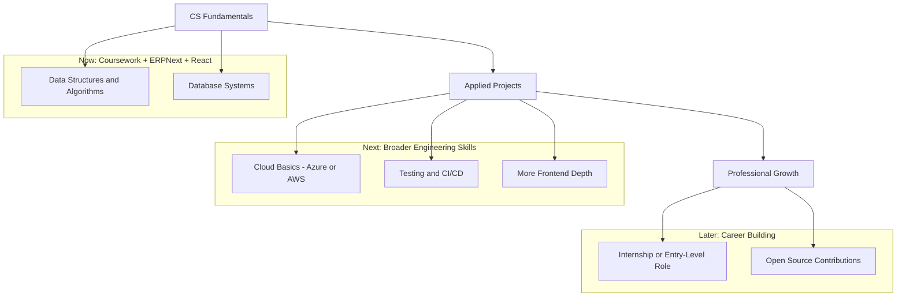

<div align="center">

<!-- ============================================================ -->
<!-- HEADER BANNER                                                 -->
<!-- ============================================================ -->


<!-- ============================================================ -->
<!-- TYPING ANIMATION                                              -->
<!-- ============================================================ -->


<!-- ============================================================ -->
<!-- PROFILE BADGES                                                -->
<!-- ============================================================ -->
<p align="center">
  
  
  
  
</p>

<h3>🎓 Computer Science Student • Building Systems for a Global Audience 🌐</h3>

<p>
  <a href="#about-me">About</a> •
  <a href="#tech-stack">Tech Stack</a> •
  <a href="#featured-projects">Projects</a> •
  <a href="#github-analytics">Analytics</a> •
  <a href="#roadmap">Roadmap</a> •
  <a href="#lets-connect">Contact</a>
</p>

---

</div>

## About Me

<div align="center">
<table>
<tr>
<td width="55%" valign="top">

```typescript
/**
 * @profile Biniyam Tehakele
 * @role    Computer Science Student
 * @base    Addis Ababa, Ethiopia (UTC+3)
 * @open_to Internships · Freelance · Remote collaboration
 */
const profile = {
  base: "Addis Ababa, Ethiopia",
  status: "Computer Science student",
  learning: [
    "Enterprise Resource Planning (ERP)",
    "System Architecture",
    "Full-Stack Web Development",
  ],
  toolkit: [".NET Core", "Python", "React", "TypeScript"],
  goal: "Turning classroom concepts into real, working software.",
  currentlyBuilding: "ERP automation & workflow tooling",
};

function introduce(p: typeof profile): string {
  return [
    `Hi, I'm Biniyam — a ${p.status} based in ${p.base}.`,
    `I'm learning ${p.learning.join(", ")}.`,
    `Currently building: ${p.currentlyBuilding}`,
  ].join("\n");
}

console.log(introduce(profile));
```

I'm a Computer Science student based in Ethiopia, currently learning
backend architecture (ERPNext/Frappe) and modern frontend development
(React/TypeScript) alongside my coursework. I enjoy turning what I
learn in class into real projects, and I'm open to internships,
freelance work, and remote collaboration with teams anywhere in the
world.

**What I'm focused on right now:**
- Strengthening my computer science fundamentals (data structures, algorithms, databases)
- Building practical ERP automation projects to apply what I learn
- Getting comfortable with modern frontend tooling (React, TypeScript)
- Contributing to small open-source scripts and repositories

</td>
<td width="45%" align="center">

</td>
</tr>
</table>
</div>

---

## Tech Stack

<div align="center">

**Frontend**
<br/>


**Backend & Systems**
<br/>


**Data & Infrastructure**
<br/>


**Tools & Workflow**
<br/>


</div>

### What I'm Learning vs. What I'm Comfortable With

| Category | Technologies | Level |
| :--- | :--- | :--- |
| Backend Frameworks | ERPNext / Frappe, .NET Core, Express | Comfortable |
| Languages | Python, JavaScript, TypeScript, C# | Comfortable |
| Frontend | React, Next.js, Tailwind CSS | Learning |
| Databases | PostgreSQL, MySQL, MongoDB, Redis | Comfortable |
| DevOps | Docker, Azure, GitHub Actions | Learning |
| CS Fundamentals | Data structures, algorithms, OS, networks | Studying (coursework) |

---

## Featured Projects

<div align="center">
<table>
<tr>
<td width="50%" valign="top">

### ECX Property Automation System (PAS)

**ERPNext customization project for a commodity exchange platform.**

- Custom safety-box logic with dynamic weight/volume validation
- Enterprise-scale asset and custodian tracking
- Automated GRN/SIV document workflows
- Server-side scripting to enforce business rules

**Stack:** Frappe / ERPNext, Python, MariaDB

[](https://github.com/BinaDev29/ERPNext_Server_Script/tree/main/Stock)

</td>
<td width="50%" valign="top">

### ERPNext HR Automation

**HR management customization aligned with local labor-law rules.**

- Dynamic leave allocation (annual, sick, maternity)
- Automated severance/termination pay calculations
- Probation-expiry alerts and automated workflows
- Basic HR reporting for management review

**Stack:** Frappe / ERPNext, Python, JavaScript

[](https://github.com/BinaDev29/ERPNext_Server_Script/tree/main/HR)

</td>
</tr>
</table>
</div>

<div align="center">

[](https://github.com/BinaDev29?tab=repositories)

</div>

---

## GitHub Analytics

<div align="center">


<br/>


<br/><br/>


</div>

> **Why the Stats/Top Languages cards broke:** the public
> `github-readme-stats.vercel.app` endpoint is well documented as unreliable
> — it's frequently rate-limited or outright down for everyone, not
> something specific to your profile (see
> [anuraghazra/github-readme-stats#4680](https://github.com/anuraghazra/github-readme-stats/issues/4680)
> and [#4748](https://github.com/anuraghazra/github-readme-stats/issues/4748)).
> Instead of pointing at that flaky shared service, those two cards now load
> static SVGs (`generated/overview.svg` / `generated/languages.svg`) that a
> scheduled GitHub Action renders and commits directly into your own profile
> repo — see the setup section below. They won't display until that
> workflow has run once.
>
> **Streak Stats and Activity Graph** are left on their original public
> services since they rendered fine for you — but they run on similarly
> shared infrastructure, so if either ever goes blank the fix is the same:
> self-host, or generate as a static SVG via Action.
>
> **On private repos:** these cards only reflect *public* activity by
> default. Your total contribution count on your actual GitHub profile page
> already includes private commits (visible to you, or to anyone you've
> chosen to show private contributions to) — that's controlled by GitHub
> itself, not by these badge services. To have the Stats card also include
> private contributions, add a personal access token as the `PAT_1` secret
> in the workflow below.

<br/>


> Animated snake that eats through your contribution graph, generated by a
> scheduled GitHub Action. See setup instructions below the Roadmap section —
> it needs a one-time workflow file added to your profile repo before this
> image will render.

---

## Roadmap


```mermaid
graph TD
    A[CS Fundamentals] --> B[Applied Projects]
    B --> C[Professional Growth]

    subgraph "Now: Coursework + ERPNext + React"
    A1[Data Structures and Algorithms]
    A2[Database Systems]
    end

    subgraph "Next: Broader Engineering Skills"
    B1[Cloud Basics - Azure or AWS]
    B2[Testing and CI/CD]
    B3[More Frontend Depth]
    end

    subgraph "Later: Career Building"
    C1[Internship or Entry-Level Role]
    C2[Open Source Contributions]
    end

    A --> A1 & A2
    B --> B1 & B2 & B3
    C --> C1 & C2
```

### Milestones

- [x] Build ERP automation for a commodity exchange platform
- [x] Build an HR automation module for ERPNext
- [ ] Complete core CS coursework (algorithms, OS, networks)
- [ ] Contribute to an open-source Frappe/ERPNext repository
- [ ] Complete a summer internship
- [ ] Build a personal full-stack project from scratch

---

## Setting Up the Stats & Top Languages Cards

These are generated as static SVGs by [`jstrieb/github-stats`](https://github.com/jstrieb/github-stats),
a GitHub Action that writes `generated/overview.svg` and
`generated/languages.svg` straight into your profile repo — no dependency on
the flaky public Vercel endpoint.

1. In `BinaDev29/BinaDev29`, create `.github/workflows/github-stats.yml`
   with the contents below.
2. (Optional, recommended) Create a
   [personal access token](https://github.com/settings/tokens) with the
   `repo` scope so private repos and full contribution history are counted,
   then add it as a repo secret named `ACCESS_TOKEN`.
3. Commit and push. Trigger it once manually from the Actions tab, or wait
   for the daily schedule.

```yaml
name: generate-stats

on:
  schedule:
    - cron: "30 12 * * *"  # runs once a day
  workflow_dispatch:         # lets you trigger it manually from the Actions tab

jobs:
  build:
    runs-on: ubuntu-latest
    steps:
      - name: generate stats images
        uses: jstrieb/github-stats@master
        with:
          username: BinaDev29
          # Optional: omit if you didn't add the ACCESS_TOKEN secret
          access_token: ${{ secrets.ACCESS_TOKEN }}
          exclude_repos: BinaDev29/BinaDev29
```

The action commits `generated/overview.svg` and `generated/languages.svg`
back into the `main` branch automatically, matching the `` paths
already in this README.

---

## Setting Up the Contribution Snake

The animated snake above won't render until you add a small GitHub Action to
your **profile repo** (the repo named exactly `BinaDev29`, same as your
username). One-time setup:

1. In `BinaDev29/BinaDev29`, create the file `.github/workflows/snake.yml`
   with the contents below.
2. Commit and push it to `main`.
3. Go to the **Actions** tab and manually trigger the "generate animation"
   workflow once (it also runs automatically every day at midnight UTC).
4. It will create/update an `output` branch containing the generated SVG —
   the `` tag already added to this README points at that branch, so
   it'll start showing up automatically once the action finishes.

```yaml
name: generate animation

on:
  schedule:
    - cron: "0 0 * * *"   # runs once a day
  workflow_dispatch:        # lets you trigger it manually from the Actions tab

jobs:
  generate:
    permissions:
      contents: write
    runs-on: ubuntu-latest
    steps:
      - name: generate github-contribution-grid-snake.svg
        uses: Platane/snk@v3
        with:
          github_user_name: BinaDev29
          outputs: |
            dist/github-contribution-grid-snake.svg
            dist/github-contribution-grid-snake-dark.svg?palette=github-dark

      - name: push github-contribution-grid-snake.svg to the output branch
        uses: crazy-max/ghaction-github-pages@v4
        with:
          target_branch: output
          build_dir: dist
        env:
          GITHUB_TOKEN: ${{ secrets.GITHUB_TOKEN }}
```

**Optional:** if you'd rather have a dark/light adaptive version, swap the
`` tag in the README for:

```html
<picture>
  <source media="(prefers-color-scheme: dark)" srcset="https://raw.githubusercontent.com/BinaDev29/BinaDev29/output/github-contribution-grid-snake-dark.svg" />
  <source media="(prefers-color-scheme: light)" srcset="https://raw.githubusercontent.com/BinaDev29/BinaDev29/output/github-contribution-grid-snake.svg" />
  
</picture>
```

---

## Let's Connect

<div align="center">

<p align="center">
<a href="mailto:biniyamtehakele9@gmail.com">

</a>
<a href="https://linkedin.com/in/binitehakele">

</a>
<a href="https://biniyamtehakeleportfolio.netlify.app">

</a>
<a href="https://calendly.com/biniyamtehakele">

</a>
</p>

| Location | Timezone | Working Hours (local) | Typical Response Time |
| :--- | :--- | :--- | :--- |
| Addis Ababa, Ethiopia | UTC+3 (EAT) | 09:00–18:00 EAT | Within 12 hours |

Open to internships, freelance projects, and remote collaboration with
teams anywhere in the world — comfortable coordinating across US, EU,
and APAC time zones.

</div>

---

<div align="center">

*"Still learning, still building — one project at a time."*


</div>
