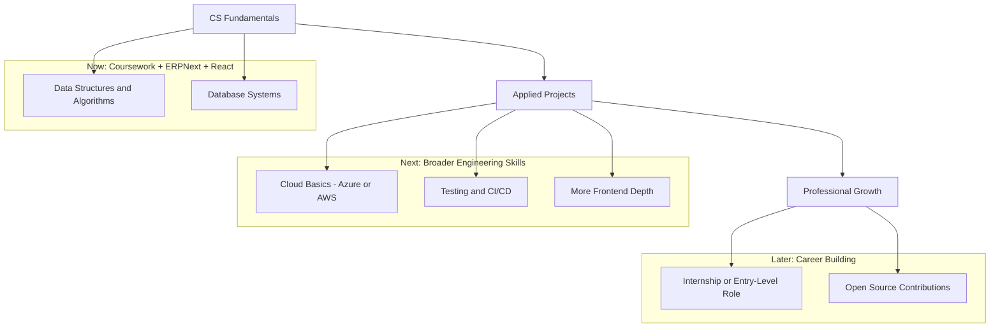

<div align="center">

<!-- ============================================================ -->
<!-- HEADER BANNER                                                 -->
<!-- ============================================================ -->


<!-- ============================================================ -->
<!-- TYPING ANIMATION                                              -->
<!-- ============================================================ -->


<!-- ============================================================ -->
<!-- PROFILE BADGES                                                -->
<!-- ============================================================ -->
<p align="center">
  
  
  
  
</p>

<h3>🎓 Computer Science Student • Learning to Build Systems That Scale 🌐</h3>

<p>
  <a href="#about-me">About</a> •
  <a href="#tech-stack">Tech Stack</a> •
  <a href="#featured-projects">Projects</a> •
  <a href="#github-analytics">Analytics</a> •
  <a href="#roadmap">Roadmap</a> •
  <a href="#lets-connect">Contact</a>
</p>

---

</div>

## About Me

<div align="center">
<table>
<tr>
<td width="55%" valign="top">

```typescript
/**
 * @profile Biniyam Tehakele
 * @role   Computer Science Student
 * @base   Addis Ababa, Ethiopia
 */
const profile = {
  base: "Addis Ababa, Ethiopia",
  status: "Computer Science student",
  learning: [
    "Enterprise Resource Planning (ERP)",
    "System Architecture",
    "Full-Stack Web Development",
  ],
  toolkit: [".NET Core", "Python", "React", "TypeScript"],
  goal: "Turning classroom concepts into real, working software.",
  currentlyBuilding: "ERP automation & workflow tooling",
};

function introduce(p: typeof profile): string {
  return [
    `Hi, I'm Biniyam — a ${p.status} based in ${p.base}.`,
    `I'm learning ${p.learning.join(", ")}.`,
    `Currently building: ${p.currentlyBuilding}`,
  ].join("\n");
}

console.log(introduce(profile));
```

I'm a Computer Science student based in Ethiopia, currently learning
backend architecture (ERPNext/Frappe) and modern frontend development
(React/TypeScript) alongside my coursework. I enjoy turning what I
learn in class into real projects, and I'm open to internships,
freelance work, and collaboration with people anywhere in the world.

**What I'm focused on right now:**
- Strengthening my computer science fundamentals (data structures, algorithms, databases)
- Building practical ERP automation projects to apply what I learn
- Getting comfortable with modern frontend tooling (React, TypeScript)
- Contributing to small open-source scripts and repositories

</td>
<td width="45%" align="center">

</td>
</tr>
</table>
</div>

---

## Tech Stack

<div align="center">

**Frontend**
<br/>


**Backend & Systems**
<br/>


**Data & Infrastructure**
<br/>


**Tools & Workflow**
<br/>


</div>

### What I'm Learning vs. What I'm Comfortable With

| Category | Technologies | Level |
| :--- | :--- | :--- |
| Backend Frameworks | ERPNext / Frappe, .NET Core, Express | Comfortable |
| Languages | Python, JavaScript, TypeScript, C# | Comfortable |
| Frontend | React, Next.js, Tailwind CSS | Learning |
| Databases | PostgreSQL, MySQL, MongoDB, Redis | Comfortable |
| DevOps | Docker, Azure, GitHub Actions | Learning |
| CS Fundamentals | Data structures, algorithms, OS, networks | Studying (coursework) |

---

## Featured Projects

<div align="center">
<table>
<tr>
<td width="50%" valign="top">

### ECX Property Automation System (PAS)

**ERPNext customization project for a commodity exchange platform.**

- Custom safety-box logic with dynamic weight/volume validation
- Enterprise-scale asset and custodian tracking
- Automated GRN/SIV document workflows
- Server-side scripting to enforce business rules

**Stack:** Frappe / ERPNext, Python, MariaDB

[](https://github.com/binadev29/ERPNext_Server_Script/tree/main/Stock)

</td>
<td width="50%" valign="top">

### ERPNext HR Automation

**HR management customization aligned with local labor-law rules.**

- Dynamic leave allocation (annual, sick, maternity)
- Automated severance/termination pay calculations
- Probation-expiry alerts and automated workflows
- Basic HR reporting for management review

**Stack:** Frappe / ERPNext, Python, JavaScript

[](https://github.com/binadev29/ERPNext_Server_Script/tree/main/HR)

</td>
</tr>
</table>
</div>

<div align="center">

[](https://github.com/binadev29?tab=repositories)

</div>

---

## GitHub Analytics

<div align="center">


<br/>


<br/><br/>


</div>

> **Note:** these cards are generated by free public services. They may
> occasionally show a loading error if the shared server is temporarily
> over its API limit — this is not related to your account. The
> `cache_seconds=86400` parameter keeps the last successful result
> cached for 24 hours to minimize this.

---

## Roadmap


```mermaid
graph TD
    A[CS Fundamentals] --> B[Applied Projects]
    B --> C[Professional Growth]

    subgraph "Now: Coursework + ERPNext + React"
    A1[Data Structures and Algorithms]
    A2[Database Systems]
    end

    subgraph "Next: Broader Engineering Skills"
    B1[Cloud Basics - Azure or AWS]
    B2[Testing and CI/CD]
    B3[More Frontend Depth]
    end

    subgraph "Later: Career Building"
    C1[Internship or Entry-Level Role]
    C2[Open Source Contributions]
    end

    A --> A1 & A2
    B --> B1 & B2 & B3
    C --> C1 & C2
```

### Milestones

- [x] Build ERP automation for a commodity exchange platform
- [x] Build an HR automation module for ERPNext
- [ ] Complete core CS coursework (algorithms, OS, networks)
- [ ] Contribute to an open-source Frappe/ERPNext repository
- [ ] Complete a summer internship
- [ ] Build a personal full-stack project from scratch

---

## Let's Connect

<div align="center">

<p align="center">
<a href="mailto:biniyamtehakele9@gmail.com">

</a>
<a href="https://linkedin.com/in/binitehakele">

</a>
<a href="https://biniyamtehakeleportfolio.netlify.app">

</a>
<a href="https://calendly.com/biniyamtehakele">

</a>
</p>

| Location | Timezone | Typical Response Time |
| :--- | :--- | :--- |
| Addis Ababa, Ethiopia | UTC+3 (EAT) | Within 12 hours |

Open to internships, freelance projects, and remote collaboration with
teams anywhere in the world.

</div>

---

<div align="center">

*"Still learning, still building — one project at a time."*


</div>
